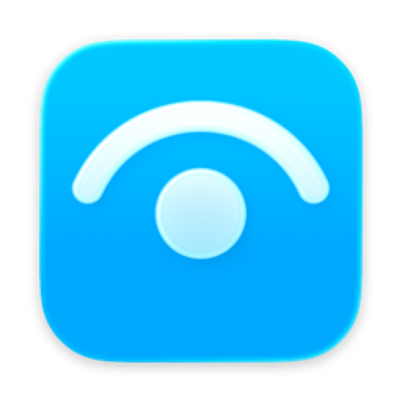
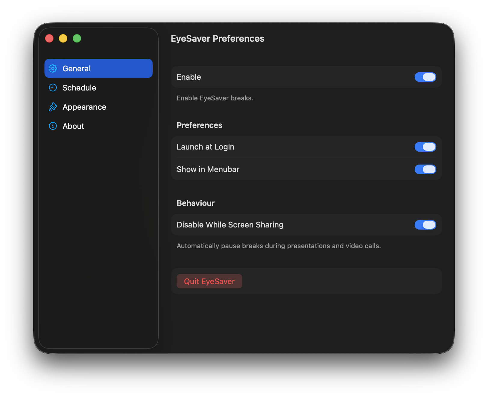

    
    <h1>EyeSaver</h1>
    
    
<i>A minimal macOS menu bar app that gently reminds you to rest your eyes.</i>

## About

EyeSaver helps you follow the **20-20-20 rule**: every 20 minutes, look at something 20 feet away for 20 seconds. It's a simple habit that reduces eye strain from extended screen time.

## How it works

At each interval, EyeSaver dims all your displays, cueing you to look away from the screen. When the break ends, the overlay fades out and the cycle continues.

## Features

- Customise interval and break duration
- Customise dimming amount
- Disable while screen sharing
- Disable while media playing
- Launch on login
- Show in Menubar

## Contributing

All issues and PRs are welcome.
